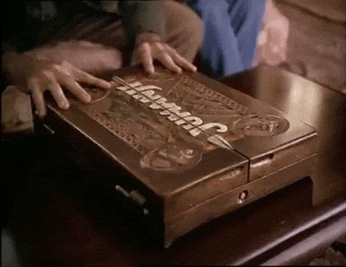
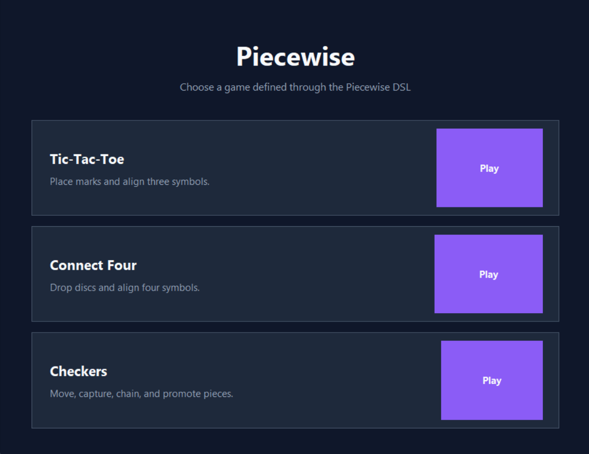
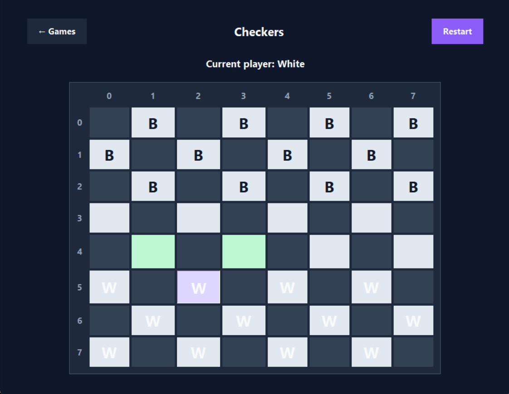
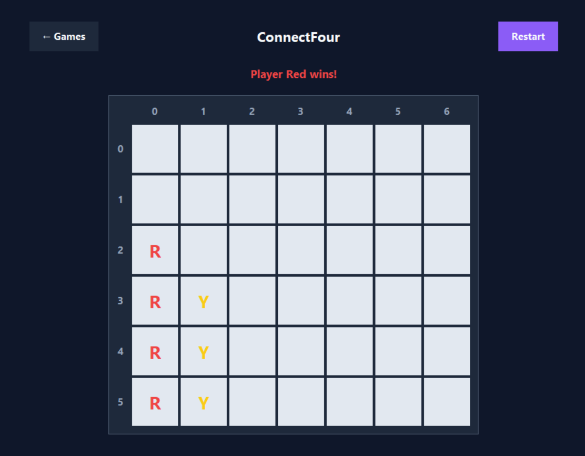

# Piecewise

<p align="center">
  
  
  <a href="https://github.com/lark-parser/lark">
    
  </a>
  
  <a href="https://github.com/Reiver56/Piecewise/actions/workflows/tests.yml">
    
  </a>
</p>

<p align="center">
  
</p>

## What is Piecewise?

Piecewise is a Domain-Specific Language (DSL) for defining and playing
deterministic, turn-based board games on rectangular grids.

A game author describes the board, players, pieces, actions, initial setup, and
end conditions in a readable `.game` file. Piecewise parses and validates that
definition, creates an immutable game state, and runs it through a shared
engine. The same definition can then be played from the command line or through
the Tkinter graphical interface.

In its simplest form:

> Write the rules of a supported board game in a `.game` file and Piecewise
> turns them into a playable application.

The project was developed for the Advanced Software Engineering course
(2025/2026) and focuses on language design, parsing, semantic validation,
immutable state, modular architecture, and automated testing.

## Included games

| Game | Main mechanics | CLI | GUI |
| --- | --- | :---: | :---: |
| Tic-Tac-Toe | Empty-cell placement, alignment, full-board draw | Yes | Yes |
| Connect Four | Column input, downward gravity, four-piece alignment | Yes | Yes |
| Checkers | Setup, movement, mandatory captures, capture chains, promotion | Yes | Yes |

The bundled Checkers definition implements the simplified rule set supported by
the current DSL. It is not intended to reproduce every official regional
variant.

## Screenshots

### Game selector

<p align="center">
  
</p>

### Graphical gameplay

<table>
  <tr>
    <td align="center"><strong>Checkers move selection</strong></td>
    <td align="center"><strong>Connect Four victory</strong></td>
  </tr>
  <tr>
    <td>
      
    </td>
    <td>
      
    </td>
  </tr>
</table>

### Command-line gameplay

<p align="center">
  
</p>

## Main features

- external DSL parsed with Lark;
- immutable, typed AST and runtime snapshots;
- cumulative semantic diagnostics with stable codes and model paths;
- direct placement, gravity placement, relocation, capture, chained capture,
  and promotion;
- legal-move generation and mandatory-capture enforcement;
- alignment, board-full, no-pieces-left, and no-moves-left conditions;
- interactive CLI with aligned boards, compact symbols, contextual help, and
  optional ANSI colours;
- responsive Tkinter interface with game selection, move highlighting,
  restart, and Checkers source selection;
- one shared engine used by both interfaces;
- 261 collected pytest cases covering the complete processing pipeline.

## Architecture

```text
.game source
    -> Lark parser
    -> Parse tree
    -> AST transformer
    -> GameDefinition
    -> SemanticValidator
    -> GameInitializer
    -> GameSession
        -> LegalMoveGenerator
        -> MoveExecutor
        -> ConditionEvaluator
    -> CLI or Tkinter GUI
```

Parsing, transformation, validation, execution, and presentation have separate
responsibilities. The engine consumes the typed model and does not need to know
how the original DSL text was written.

## Tech stack

| Technology | Purpose |
| --- | --- |
| Python 3.10+ | Application and domain model |
| Lark | LALR grammar parsing and tree transformation |
| dataclasses and enums | Typed, immutable AST and runtime state |
| Tkinter | Desktop graphical interface |
| ANSI terminal sequences | Optional CLI colours |
| pytest | Unit, integration, negative, and end-to-end tests |

## Quickstart

### Prerequisites

- Python 3.10 or newer;
- Git, when cloning the repository;
- Tkinter, normally included with standard Python installations.

### Local setup

```bash
git clone https://github.com/Reiver56/Piecewise.git
cd Piecewise
python -m venv .venv
```

Activate the virtual environment.

Windows PowerShell:

```powershell
.venv\Scripts\Activate.ps1
```

macOS or Linux:

```bash
source .venv/bin/activate
```

Install the dependencies:

```bash
python -m pip install -r requirements.txt
```

## Play from the graphical interface

Start the game selector:

```bash
python -m gui
```

Choose Tic-Tac-Toe, Connect Four, or Checkers. The interface displays the
current player, legal destinations, selected Checkers pieces, final results,
and restart controls.

Read the [graphical-interface guide](gui/gui_README.md) for controller
behaviour, symbols, theme, and tests.

## Play from the terminal

Tic-Tac-Toe is the default:

```bash
python -m cli
```

Select a definition explicitly:

```bash
python -m cli games/tictactoe.game
python -m cli games/connectfour.game
python -m cli games/checkers.game
```

The CLI enables colours automatically when output is connected to a compatible
terminal. Disable them when necessary:

```bash
python -m cli games/checkers.game --no-color
```

| Action type | Input |
| --- | --- |
| Direct placement | `row column` |
| Gravity placement | `column` |
| Relocation or capture | `source_row source_column destination_row destination_column` |
| Exit | `quit` |

Read the [CLI guide](cli/cli_README.md) for input rules, colour behaviour, and
programmatic use.

## Define a game

Definitions use domain concepts rather than Python code:

```text
game TicTacToe {
    board {
        size: 3x3
        playable_cells: all
    }

    players {
        player X
        player O
        turn_order: X, O
    }

    piece Mark {
        owner: X, O
        place: any_empty_cell
    }

    win_conditions {
        align: 3 same_row -> win
        align: 3 same_col -> win
        align: 3 diagonal -> win
        board_full: no_winner -> draw
    }
}
```

The language deliberately exposes a bounded set of reusable mechanics. Adding a
new game that combines existing mechanics is mainly a modelling task; adding a
new kind of mechanic requires coordinated grammar, AST, validation, and engine
changes.

Read [Defining a Game in Piecewise](games/games_README.md) for the complete
syntax, semantic rules, examples, and extension checklist.

## Documentation

The root README is a project overview. Detailed documentation lives beside the
code it describes:

| Area | Documentation |
| --- | --- |
| Game definitions | [games/games_README.md](games/games_README.md) |
| Formal grammar | [grammar/grammar_README.md](grammar/grammar_README.md) |
| Parser, transformer, and AST | [parser/parser_README.md](parser/parser_README.md) |
| Semantic validation | [validation/validation_README.md](validation/validation_README.md) |
| Runtime engine | [engine/engine_README.md](engine/engine_README.md) |
| Command-line interface | [cli/cli_README.md](cli/cli_README.md) |
| Graphical interface | [gui/gui_README.md](gui/gui_README.md) |
| Test strategy and coverage | [tests/tests_README.md](tests/tests_README.md) |

## Run the tests

Run the complete suite from the repository root:

```bash
python -m pytest -v
```

The documented final run collected and passed 261 cases. They cover syntax,
AST transformation, semantic validation, initialization, immutable state,
execution, move generation, game conditions, rendering, CLI interaction, GUI
controller behaviour, and complete Checkers scenarios.

See the [testing guide](tests/tests_README.md) for the test groups, fixtures,
levels, and focused commands.

## Project boundaries

Piecewise currently targets local, deterministic, turn-based games on
rectangular boards. It does not yet provide arbitrary movement scripts, cards,
dice, hidden information, saved matches, AI opponents, online multiplayer, or
complete official rule sets for every Checkers variant.

These are deliberate boundaries of the current language rather than claims
that every board game can be represented without extending the implementation.
